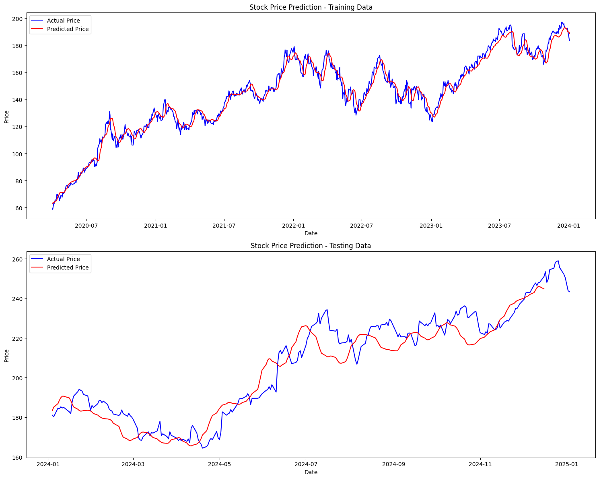
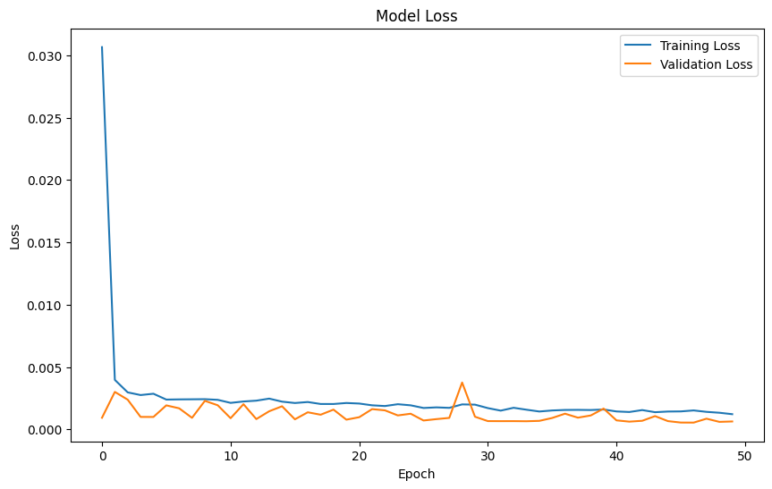

# LSTM Stock Price Prediction Using Web Scraping  

This project predicts stock prices using a Long Short-Term Memory (LSTM) neural network. The stock data is scraped from Yahoo Finance, preprocessed, and used to train the model for accurate forecasting.  

## Features  
- Web scraping of stock data using **Yahoo Finance**.  
- Data preprocessing for model readiness.  
- LSTM implementation for time-series prediction.  
- Visualization of predicted vs actual stock prices.  

## Prerequisites  
- Python 3.7+  
- Libraries:  
  ```
  pandas  
  numpy  
  matplotlib  
  tensorflow  
  yfinance  
  sklearn  
  ```

## How to Use  
1. Clone this repository:  
   ```
   git clone https://github.com/ruru-lyy/LSTM-Stock-price-prediction
   ```  
2. Install the required libraries:  
   ```
   pip install -r requirements.txt
   ```  
3. Run the script to scrape data and train the model


## Results  
- Outputs the predicted stock prices compared to actual data with visualizations.
  
  

